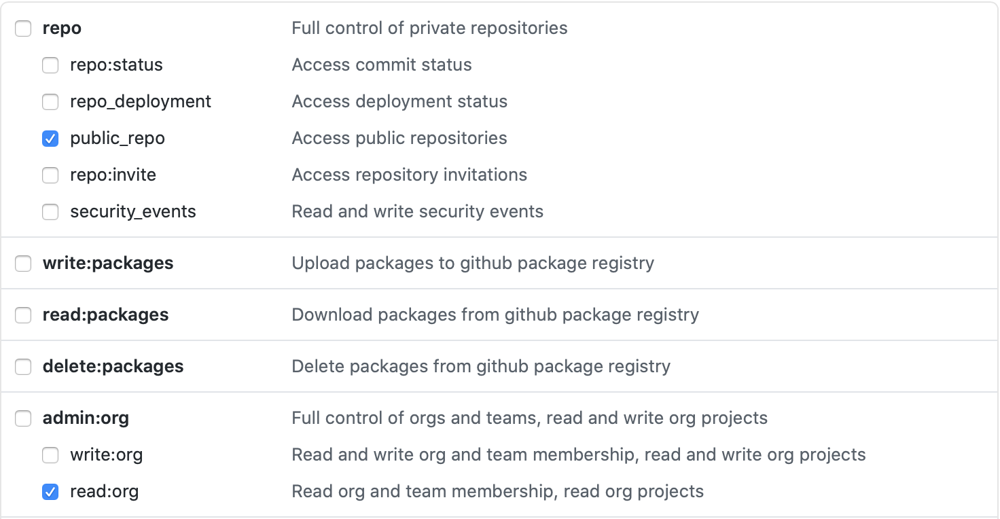

# conda-forge-contribution
[](https://travis-ci.com/jan-janssen/conda-forge-contribution)

This repository allows you to quickly generate a list of all your [conda-forge](https://conda-forge.org) contributions.

For example the contributions of [jan-janssen](https://github.com/jan-janssen) are available at [https://jan-janssen.github.io/conda-forge-contribution/](https://jan-janssen.github.io/conda-forge-contribution/).

To generate your own contribution-list, simply fork this repository and set the following variables for your [travis-ci.com](https://travis-ci.com) build environment:

```
USERNAME = <your Github username>
GH_TOKEN = <your Github token which enables access to public_repo and read:org>
```

For the token the following permissions are required:


Designed by [colorlib](https://colorlib.com/wp/template/responsive-table-v2/).
# List of Packages 

| Package Name | Downloads |
|:------------:|:---------:|
| [jplephem](https://anaconda.org/conda-forge/jplephem) | [](https://anaconda.org/conda-forge/jplephem) |
| [ipycache](https://anaconda.org/conda-forge/ipycache) | [](https://anaconda.org/conda-forge/ipycache) |
| [jupyterlab](https://anaconda.org/conda-forge/jupyterlab) | [](https://anaconda.org/conda-forge/jupyterlab) |
| [hypothesis](https://anaconda.org/conda-forge/hypothesis) | [](https://anaconda.org/conda-forge/hypothesis) |
| [ase](https://anaconda.org/conda-forge/ase) | [](https://anaconda.org/conda-forge/ase) |
| [sgp4](https://anaconda.org/conda-forge/sgp4) | [](https://anaconda.org/conda-forge/sgp4) |
| [skyfield](https://anaconda.org/conda-forge/skyfield) | [](https://anaconda.org/conda-forge/skyfield) |
| [spglib](https://anaconda.org/conda-forge/spglib) | [](https://anaconda.org/conda-forge/spglib) |
| [curio](https://anaconda.org/conda-forge/curio) | [](https://anaconda.org/conda-forge/curio) |
| [phonopy](https://anaconda.org/conda-forge/phonopy) | [](https://anaconda.org/conda-forge/phonopy) |
| [elastic](https://anaconda.org/conda-forge/elastic) | [](https://anaconda.org/conda-forge/elastic) |
| [attrs](https://anaconda.org/conda-forge/attrs) | [](https://anaconda.org/conda-forge/attrs) |
| [asap3](https://anaconda.org/conda-forge/asap3) | [](https://anaconda.org/conda-forge/asap3) |
| [alm](https://anaconda.org/conda-forge/alm) | [](https://anaconda.org/conda-forge/alm) |
| [phono3py](https://anaconda.org/conda-forge/phono3py) | [](https://anaconda.org/conda-forge/phono3py) |
